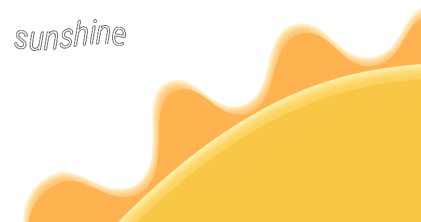

   
  
   [![License][shield-repo-license]][repo-license]
   ![Stars][shield-repo-stars]

---

> [!WARNING]
> This is a work-in-progress project. Some features may not work correctly or may not be implemented yet.

Sunshine is a third-party replacement for the standard Roblox bootstrapper (a Roblox launcher),
inspired by [Bloxstrap](https://github.com/pizzaboxer/bloxstrap) and [AppleBlox](https://github.com/AppleBlox/appleblox).

Sunshine is ***only supported*** on **Windows**.

> [!NOTE]
> Sunshine only supports **Windows 10 and above**. Use [**AppleBlox**](https://github.com/AppleBlox/appleblox) *(for macOS)* or [**Sober**](https://sober.vinegarhq.org) *(for Linux)*.

# License
Sunshine is licensed under [GNU GPLv3](LICENSE). You can check out licenses from used packages in Sunshine's "About" tab.

[shield-repo-license]:  https://img.shields.io/github/license/tachy0nnn/sunshine?style=flat-square&color=f8c745
[shield-repo-stars]:  https://img.shields.io/github/stars/tachy0nnn/sunshine?style=flat-square&color=f8c745
[repo-license]:  https://github.com/tachy0nnn/sunshine/blob/main/LICENSE
